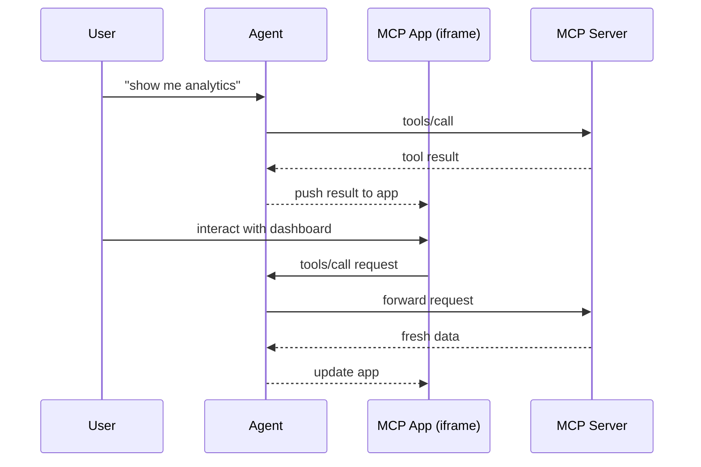

# Best Practices Research: General Manager App

This document synthesizes best practices for building a "General Manager" app that manages small business operations through an MCP interface.

---

## Table of Contents

1. [OAuth 2.1 Implementation for Remote MCP Servers](#1-oauth-21-implementation-for-remote-mcp-servers)
2. [MCP Apps Extension Patterns for Interactive Dashboards](#2-mcp-apps-extension-patterns-for-interactive-dashboards)
3. [Task Scheduling Architectures for SaaS (TypeScript/Node.js)](#3-task-scheduling-architectures-for-saas-typescriptnodejs)
4. [Multi-Tenant Database Patterns](#4-multi-tenant-database-patterns)

---

## 1. OAuth 2.1 Implementation for Remote MCP Servers

### Overview

MCP provides authorization capabilities at the transport level using OAuth 2.1. This enables MCP clients to make requests to restricted MCP servers on behalf of resource owners.

**Source:** [MCP Authorization Specification](https://modelcontextprotocol.io/specification/2025-03-26/basic/authorization)

### Core Requirements

| Requirement | Description |
|-------------|-------------|
| **PKCE Required** | All clients MUST use PKCE (Proof Key for Code Exchange) |
| **OAuth 2.1 Compliance** | Implementations MUST follow OAuth 2.1 draft specification |
| **HTTPS Only** | All authorization endpoints MUST be served over HTTPS |
| **Bearer Tokens** | Access tokens MUST be sent via `Authorization: Bearer` header |

### Server Metadata Discovery

MCP servers SHOULD implement RFC 8414 (OAuth 2.0 Authorization Server Metadata):

```
GET /.well-known/oauth-authorization-server
```

**Authorization Base URL Determination:**
- Strip the path component from MCP server URL
- Example: `https://api.example.com/v1/mcp` -> Base URL: `https://api.example.com`

**Fallback Endpoints (when metadata discovery fails):**

| Endpoint | Default Path |
|----------|--------------|
| Authorization | `/authorize` |
| Token | `/token` |
| Registration | `/register` |

### PKCE Implementation Pattern

```typescript
// 1. Generate cryptographic values
const codeVerifier = generateRandomString(43, 128); // URL-safe characters
const codeChallenge = base64url(sha256(codeVerifier));

// 2. Authorization request includes code_challenge
const authUrl = new URL(authorizationEndpoint);
authUrl.searchParams.set('response_type', 'code');
authUrl.searchParams.set('client_id', clientId);
authUrl.searchParams.set('redirect_uri', redirectUri);
authUrl.searchParams.set('code_challenge', codeChallenge);
authUrl.searchParams.set('code_challenge_method', 'S256');
authUrl.searchParams.set('scope', requestedScopes);

// 3. Token exchange includes code_verifier
const tokenResponse = await fetch(tokenEndpoint, {
  method: 'POST',
  headers: { 'Content-Type': 'application/x-www-form-urlencoded' },
  body: new URLSearchParams({
    grant_type: 'authorization_code',
    code: authorizationCode,
    redirect_uri: redirectUri,
    client_id: clientId,
    code_verifier: codeVerifier, // Server verifies SHA256(this) == code_challenge
  }),
});
```

### Dynamic Client Registration

MCP clients and servers SHOULD support RFC 7591:

```typescript
// POST /register
const registrationResponse = await fetch(registrationEndpoint, {
  method: 'POST',
  headers: { 'Content-Type': 'application/json' },
  body: JSON.stringify({
    client_name: 'General Manager App',
    redirect_uris: ['http://localhost:3000/callback'],
    grant_types: ['authorization_code', 'refresh_token'],
    response_types: ['code'],
    token_endpoint_auth_method: 'none', // Public client
  }),
});

const { client_id } = await registrationResponse.json();
```

### OAuth Grant Types for Different Use Cases

| Grant Type | Use Case | Example |
|------------|----------|---------|
| **Authorization Code** | Human end-user acting through the app | User authorizes access to their CRM data |
| **Client Credentials** | Machine-to-machine, no human involved | Background job checking inventory |

### Token Validation & Usage

```typescript
// Every HTTP request MUST include the Authorization header
const mcpRequest = await fetch(mcpServerUrl, {
  method: 'POST',
  headers: {
    'Content-Type': 'application/json',
    'Authorization': `Bearer ${accessToken}`, // REQUIRED on every request
  },
  body: JSON.stringify(mcpPayload),
});

// Handle 401 responses - trigger token refresh or re-authorization
if (mcpRequest.status === 401) {
  if (refreshToken) {
    await refreshAccessToken();
  } else {
    await initiateAuthorizationFlow();
  }
}
```

### Security Checklist

- [ ] PKCE required for ALL clients (public and confidential)
- [ ] Never include tokens in URL query strings
- [ ] Implement secure token storage (encrypted at rest)
- [ ] Validate all redirect URIs (exact match only)
- [ ] Redirect URIs must be localhost or HTTPS
- [ ] Implement token expiration and rotation
- [ ] Include `MCP-Protocol-Version` header during discovery

### Third-Party Authorization Flow

For delegating to external OAuth providers (e.g., Google, GitHub):

```
MCP Client -> MCP Server -> Third-Party Auth Server
                  |
           Maintains token mapping
           Validates third-party status
           Issues bound MCP tokens
```

---

## 2. MCP Apps Extension Patterns for Interactive Dashboards

### Overview

MCP Apps allow servers to return interactive HTML interfaces (dashboards, forms, visualizations) that render directly in the conversation. Released January 26, 2026.

**Sources:**
- [MCP Apps Documentation](https://modelcontextprotocol.io/docs/extensions/apps)
- [MCP Apps Announcement](https://blog.modelcontextprotocol.io/posts/2026-01-26-mcp-apps/)

### Core Architecture

MCP Apps combine two primitives:
1. **Tool with UI metadata** - Declares a `_meta.ui.resourceUri` pointing to the UI
2. **UI Resource** - HTML/JS that renders in a sandboxed iframe



### Project Structure

```
my-mcp-app/
  package.json
  tsconfig.json
  vite.config.ts
  server.ts          # MCP server with tool + resource
  mcp-app.html       # UI entry point
  src/
    mcp-app.ts       # UI logic
```

### Server Implementation

```typescript
// server.ts
import { McpServer } from "@modelcontextprotocol/sdk/server/mcp.js";
import { StreamableHTTPServerTransport } from "@modelcontextprotocol/sdk/server/streamableHttp.js";
import {
  registerAppTool,
  registerAppResource,
  RESOURCE_MIME_TYPE,
} from "@modelcontextprotocol/ext-apps/server";
import express from "express";
import cors from "cors";
import fs from "node:fs/promises";
import path from "node:path";

const server = new McpServer({
  name: "General Manager Dashboard",
  version: "1.0.0",
});

// UI resource URI uses ui:// scheme
const resourceUri = "ui://dashboard/analytics.html";

// Register tool that returns dashboard data
registerAppTool(
  server,
  "show-analytics",
  {
    title: "Analytics Dashboard",
    description: "Shows business analytics dashboard",
    inputSchema: {
      type: "object",
      properties: {
        dateRange: { type: "string", enum: ["7d", "30d", "90d"] },
        metrics: { type: "array", items: { type: "string" } },
      },
    },
    _meta: { ui: { resourceUri } }, // Links tool to UI
  },
  async (args) => {
    const data = await fetchAnalyticsData(args);
    return {
      content: [{ type: "text", text: JSON.stringify(data) }],
    };
  }
);

// Register resource that serves the bundled HTML
registerAppResource(
  server,
  resourceUri,
  resourceUri,
  { mimeType: RESOURCE_MIME_TYPE },
  async () => {
    const html = await fs.readFile(
      path.join(import.meta.dirname, "dist", "analytics.html"),
      "utf-8"
    );
    return {
      contents: [{ uri: resourceUri, mimeType: RESOURCE_MIME_TYPE, text: html }],
    };
  }
);

// HTTP transport
const expressApp = express();
expressApp.use(cors());
expressApp.use(express.json());

expressApp.post("/mcp", async (req, res) => {
  const transport = new StreamableHTTPServerTransport({
    sessionIdGenerator: undefined,
    enableJsonResponse: true,
  });
  res.on("close", () => transport.close());
  await server.connect(transport);
  await transport.handleRequest(req, res, req.body);
});

expressApp.listen(3001);
```

### UI Implementation

```html
<!-- mcp-app.html -->
<!DOCTYPE html>
<html lang="en">
<head>
  <meta charset="UTF-8">
  <title>Analytics Dashboard</title>
  <script src="https://cdn.jsdelivr.net/npm/chart.js"></script>
</head>
<body>
  <div id="dashboard">
    <canvas id="revenue-chart"></canvas>
    <button id="refresh-btn">Refresh Data</button>
  </div>
  <script type="module" src="/src/mcp-app.ts"></script>
</body>
</html>
```

```typescript
// src/mcp-app.ts
import { App } from "@modelcontextprotocol/ext-apps";

const app = new App({ name: "Analytics Dashboard", version: "1.0.0" });

// Establish communication with host
app.connect();

// Handle initial tool result from host
app.ontoolresult = (result) => {
  const data = JSON.parse(result.content?.find(c => c.type === "text")?.text || "{}");
  renderDashboard(data);
};

// Proactively call server tools on user interaction
document.getElementById("refresh-btn")?.addEventListener("click", async () => {
  const result = await app.callServerTool({
    name: "show-analytics",
    arguments: { dateRange: "30d", metrics: ["revenue", "customers"] },
  });
  const data = JSON.parse(result.content?.find(c => c.type === "text")?.text || "{}");
  renderDashboard(data);
});

// Update model context when user makes selections
function onUserSelection(selection: object) {
  app.updateContext({ userSelection: selection });
}
```

### Dashboard Use Cases for General Manager

| Use Case | Implementation |
|----------|----------------|
| **Sales Dashboard** | Interactive charts with filtering by region, drill-down to accounts |
| **Inventory Management** | Real-time stock levels, reorder alerts, trend visualization |
| **Employee Scheduling** | Calendar view, drag-drop shifts, conflict detection |
| **Financial Reports** | P&L statements, cash flow, exportable tables |
| **Customer Pipeline** | Kanban board, deal stages, conversion metrics |

### Security Model

- Apps run in **sandboxed iframes** controlled by the host
- No access to parent page DOM, cookies, or storage
- Communication via `postMessage` JSON-RPC
- Host controls which capabilities apps can access
- Pre-declared templates enable host review

### Build Configuration

```typescript
// vite.config.ts
import { defineConfig } from "vite";
import { viteSingleFile } from "vite-plugin-singlefile";

export default defineConfig({
  plugins: [viteSingleFile()], // Bundle everything into single HTML
  build: {
    outDir: "dist",
    rollupOptions: {
      input: process.env.INPUT, // Set via INPUT=mcp-app.html
    },
  },
});
```

```json
// package.json
{
  "type": "module",
  "scripts": {
    "build": "INPUT=mcp-app.html vite build",
    "serve": "npx tsx server.ts"
  },
  "dependencies": {
    "@modelcontextprotocol/ext-apps": "^1.0.0",
    "@modelcontextprotocol/sdk": "^1.0.0"
  }
}
```

### Supported Hosts

- Claude (web and desktop)
- Visual Studio Code (Insiders)
- Goose
- Postman
- MCPJam

---

## 3. Task Scheduling Architectures for SaaS (TypeScript/Node.js)

### Recommended Libraries

| Library | Backing Store | Best For | Benchmark |
|---------|--------------|----------|-----------|
| **BullMQ** | Redis | High-volume, distributed queues | 87.1 |
| **Temporal** | PostgreSQL/MySQL | Complex workflows, long-running processes | 81.9 |
| **bunqueue** | SQLite | Bun runtime, embedded use | 94.8 |

**Sources:**
- [BullMQ Documentation](https://bullmq.io)
- [Temporal Documentation](https://docs.temporal.io)

### BullMQ Patterns (Recommended for General Manager)

#### Job Schedulers with Cron

```typescript
import { Queue, Worker } from 'bullmq';

const connection = { host: 'localhost', port: 6379 };
const queue = new Queue('business-tasks', { connection });

// Daily report at 6 AM
await queue.upsertJobScheduler(
  'daily-report',
  { pattern: '0 0 6 * * *' }, // Cron: 6:00 AM daily
  {
    name: 'generate-daily-report',
    data: { reportType: 'daily-summary' },
    opts: {
      attempts: 3,
      backoff: { type: 'exponential', delay: 5000 },
    },
  }
);

// Invoice reminders every Monday at 9 AM
await queue.upsertJobScheduler(
  'invoice-reminders',
  { pattern: '0 0 9 * * 1' }, // Cron: Monday 9:00 AM
  {
    name: 'send-invoice-reminders',
    data: { reminderType: 'overdue' },
  }
);

// Inventory check every 4 hours
await queue.upsertJobScheduler(
  'inventory-check',
  { every: 4 * 60 * 60 * 1000 }, // Every 4 hours
  {
    name: 'check-inventory-levels',
    data: { threshold: 'low' },
  }
);
```

#### Worker Implementation

```typescript
const worker = new Worker(
  'business-tasks',
  async (job) => {
    switch (job.name) {
      case 'generate-daily-report':
        return await generateReport(job.data);
      case 'send-invoice-reminders':
        return await sendReminders(job.data);
      case 'check-inventory-levels':
        return await checkInventory(job.data);
      default:
        throw new Error(`Unknown job: ${job.name}`);
    }
  },
  {
    connection,
    concurrency: 5, // Process 5 jobs simultaneously
  }
);

// Error handling
worker.on('failed', (job, err) => {
  console.error(`Job ${job?.id} failed:`, err.message);
  // Alert on critical failures
  if (job?.name === 'generate-daily-report') {
    alertOps(`Daily report generation failed: ${err.message}`);
  }
});

worker.on('completed', (job, result) => {
  console.log(`Job ${job.id} completed:`, result);
});
```

#### Job Flows (Parent-Child Dependencies)

```typescript
import { FlowProducer } from 'bullmq';

const flowProducer = new FlowProducer({ connection });

// Complex workflow: End-of-month processing
await flowProducer.add({
  name: 'month-end-processing',
  queueName: 'business-tasks',
  data: { month: '2026-01' },
  children: [
    {
      name: 'close-accounting-period',
      queueName: 'accounting',
      data: { month: '2026-01' },
      opts: { failParentOnFailure: true }, // Critical - fails parent if this fails
    },
    {
      name: 'generate-financial-reports',
      queueName: 'reports',
      data: { month: '2026-01', types: ['pnl', 'balance-sheet'] },
      opts: { failParentOnFailure: true },
    },
    {
      name: 'send-stakeholder-emails',
      queueName: 'notifications',
      data: { template: 'monthly-summary' },
      opts: { ignoreDependencyOnFailure: true }, // Optional - parent continues if this fails
    },
  ],
});
```

#### Rate Limiting & Throttling

```typescript
const rateLimitedQueue = new Queue('external-api-calls', {
  connection,
  defaultJobOptions: {
    rateLimiter: {
      max: 100,      // Max 100 jobs
      duration: 60000, // Per minute
    },
  },
});
```

### Temporal Patterns (For Complex Workflows)

```typescript
import { Connection, Client, ScheduleOverlapPolicy } from '@temporalio/client';

async function setupSchedules() {
  const connection = await Connection.connect();
  const client = new Client({ connection });

  // Scheduled workflow with calendar-based timing
  await client.schedule.create({
    scheduleId: 'weekly-payroll-processing',
    action: {
      type: 'startWorkflow',
      workflowType: 'processPayroll',
      args: [{ payPeriod: 'weekly' }],
      taskQueue: 'payroll-tasks',
    },
    spec: {
      calendars: [{
        comment: 'Every Friday at 5 PM',
        dayOfWeek: 'FRIDAY',
        hour: 17,
        minute: 0,
      }],
    },
    policies: {
      catchupWindow: '1 day', // Catch up if missed
      overlap: ScheduleOverlapPolicy.SKIP, // Skip if previous still running
    },
  });
}
```

### Architecture Recommendations for General Manager

```
┌─────────────────────────────────────────────────────────────┐
│                    General Manager App                       │
├─────────────────────────────────────────────────────────────┤
│                                                             │
│  ┌─────────────┐    ┌─────────────┐    ┌─────────────┐     │
│  │  MCP Server │    │  API Server │    │  Dashboard  │     │
│  └──────┬──────┘    └──────┬──────┘    └──────┬──────┘     │
│         │                  │                  │             │
│         └──────────────────┼──────────────────┘             │
│                            │                                │
│                    ┌───────▼───────┐                        │
│                    │  Job Producer │                        │
│                    └───────┬───────┘                        │
│                            │                                │
│                    ┌───────▼───────┐                        │
│                    │     Redis     │  (BullMQ backing)      │
│                    └───────┬───────┘                        │
│                            │                                │
│         ┌──────────────────┼──────────────────┐             │
│         │                  │                  │             │
│  ┌──────▼──────┐    ┌──────▼──────┐    ┌──────▼──────┐     │
│  │   Worker 1  │    │   Worker 2  │    │   Worker N  │     │
│  │ (Reports)   │    │ (Notifs)    │    │ (Inventory) │     │
│  └─────────────┘    └─────────────┘    └─────────────┘     │
│                                                             │
└─────────────────────────────────────────────────────────────┘
```

### Best Practices Checklist

- [ ] **Idempotency**: Design all jobs to be safely retried
- [ ] **Graceful Shutdown**: Handle SIGTERM, drain queues before exit
- [ ] **Dead Letter Queues**: Configure for jobs that exhaust retries
- [ ] **Observability**: Implement logging, metrics (job duration, failure rate)
- [ ] **Priority Queues**: Urgent tasks (e.g., payment processing) get priority
- [ ] **Persistence**: Store job state for crash recovery
- [ ] **Rate Limiting**: Protect external APIs from overload
- [ ] **Separate Workers**: Isolate by function (reports, notifications, etc.)

---

## 4. Multi-Tenant Database Patterns

### Pattern Comparison

| Pattern | Isolation | Resource Efficiency | Complexity | Best For |
|---------|-----------|---------------------|------------|----------|
| **Row-Level Security (RLS)** | Logical | High | Low | Many small tenants |
| **Schema-per-Tenant** | Schema-level | Medium | Medium | Moderate tenant count |
| **Database-per-Tenant** | Physical | Low | High | Enterprise/compliance |

**Sources:**
- [Crunchy Data - RLS for Tenants](https://www.crunchydata.com/blog/row-level-security-for-tenants-in-postgres)
- [AWS - Multi-tenant Data Isolation](https://aws.amazon.com/blogs/database/multi-tenant-data-isolation-with-postgresql-row-level-security/)
- [Nile - Shipping Multi-tenant SaaS](https://www.thenile.dev/blog/multi-tenant-rls)

### Recommended: Row-Level Security (RLS)

For a General Manager SaaS app with many small business tenants, RLS provides the best balance of security, efficiency, and simplicity.

#### Schema Design

```sql
-- Tenant table
CREATE TABLE tenants (
  id UUID PRIMARY KEY DEFAULT gen_random_uuid(),
  name TEXT NOT NULL,
  subdomain TEXT UNIQUE NOT NULL,
  plan TEXT NOT NULL DEFAULT 'starter',
  created_at TIMESTAMPTZ DEFAULT NOW()
);

-- All tenant-specific tables include tenant_id
CREATE TABLE customers (
  id UUID PRIMARY KEY DEFAULT gen_random_uuid(),
  tenant_id UUID NOT NULL REFERENCES tenants(id),
  name TEXT NOT NULL,
  email TEXT NOT NULL,
  created_at TIMESTAMPTZ DEFAULT NOW()
);

CREATE TABLE invoices (
  id UUID PRIMARY KEY DEFAULT gen_random_uuid(),
  tenant_id UUID NOT NULL REFERENCES tenants(id),
  customer_id UUID NOT NULL REFERENCES customers(id),
  amount DECIMAL(10,2) NOT NULL,
  status TEXT NOT NULL DEFAULT 'draft',
  due_date DATE,
  created_at TIMESTAMPTZ DEFAULT NOW()
);

-- Index on tenant_id for every table (critical for performance)
CREATE INDEX idx_customers_tenant ON customers(tenant_id);
CREATE INDEX idx_invoices_tenant ON invoices(tenant_id);
```

#### RLS Policy Implementation

```sql
-- Enable RLS on tenant tables
ALTER TABLE customers ENABLE ROW LEVEL SECURITY;
ALTER TABLE invoices ENABLE ROW LEVEL SECURITY;

-- Force RLS even for table owners (critical security measure)
ALTER TABLE customers FORCE ROW LEVEL SECURITY;
ALTER TABLE invoices FORCE ROW LEVEL SECURITY;

-- Create policies using session variable
CREATE POLICY tenant_isolation_customers ON customers
  USING (tenant_id = NULLIF(current_setting('app.current_tenant_id', TRUE), '')::UUID);

CREATE POLICY tenant_isolation_invoices ON invoices
  USING (tenant_id = NULLIF(current_setting('app.current_tenant_id', TRUE), '')::UUID);

-- Separate policies for INSERT (includes WITH CHECK)
CREATE POLICY tenant_insert_customers ON customers
  FOR INSERT
  WITH CHECK (tenant_id = NULLIF(current_setting('app.current_tenant_id', TRUE), '')::UUID);

CREATE POLICY tenant_insert_invoices ON invoices
  FOR INSERT
  WITH CHECK (tenant_id = NULLIF(current_setting('app.current_tenant_id', TRUE), '')::UUID);
```

#### Application Integration (TypeScript)

```typescript
import { Pool, PoolClient } from 'pg';

const pool = new Pool({
  connectionString: process.env.DATABASE_URL,
});

// Middleware to set tenant context
async function withTenantContext<T>(
  tenantId: string,
  operation: (client: PoolClient) => Promise<T>
): Promise<T> {
  const client = await pool.connect();
  try {
    // Set tenant context BEFORE any queries
    await client.query('SET app.current_tenant_id = $1', [tenantId]);

    // Execute operation - RLS automatically filters all queries
    return await operation(client);
  } finally {
    // Reset context before returning to pool
    await client.query('RESET app.current_tenant_id');
    client.release();
  }
}

// Usage in request handler
app.get('/api/customers', async (req, res) => {
  const tenantId = req.auth.tenantId; // From JWT or session

  const customers = await withTenantContext(tenantId, async (client) => {
    // No WHERE tenant_id = ? needed - RLS handles it!
    const result = await client.query(
      'SELECT id, name, email FROM customers ORDER BY created_at DESC'
    );
    return result.rows;
  });

  res.json(customers);
});

// Even JOINs work seamlessly
app.get('/api/invoices-with-customers', async (req, res) => {
  const tenantId = req.auth.tenantId;

  const invoices = await withTenantContext(tenantId, async (client) => {
    // RLS filters both tables automatically
    const result = await client.query(`
      SELECT i.*, c.name as customer_name
      FROM invoices i
      JOIN customers c ON i.customer_id = c.id
      WHERE i.status = 'pending'
    `);
    return result.rows;
  });

  res.json(invoices);
});
```

#### Connection Pooling with RLS

```typescript
// For high-throughput: Use transaction-level pooling
import { drizzle } from 'drizzle-orm/node-postgres';

async function executeWithTenant<T>(
  tenantId: string,
  query: (db: ReturnType<typeof drizzle>) => Promise<T>
): Promise<T> {
  return pool.connect().then(async (conn) => {
    try {
      await conn.query(`SET LOCAL app.current_tenant_id = '${tenantId}'`);
      const db = drizzle(conn);
      return await query(db);
    } finally {
      conn.release();
    }
  });
}
```

#### Testing RLS Policies

```sql
-- Test as a specific tenant
SET app.current_tenant_id = 'tenant-uuid-1';

-- Should only see tenant-1's data
SELECT * FROM customers;

-- Try to access another tenant's data (should return empty)
SET app.current_tenant_id = 'tenant-uuid-2';
SELECT * FROM customers WHERE id = 'customer-from-tenant-1'; -- Returns nothing

-- Verify INSERT protection
SET app.current_tenant_id = 'tenant-uuid-1';
INSERT INTO customers (tenant_id, name, email)
VALUES ('tenant-uuid-2', 'Hacker', 'hacker@evil.com'); -- FAILS with policy violation
```

### When to Consider Schema-per-Tenant

Choose schema isolation when:
- Regulatory requirements mandate physical separation
- Tenants require custom schema modifications
- Tenant data volumes vary dramatically (1000x difference)
- Per-tenant backup/restore is frequently needed

```sql
-- Schema-per-tenant pattern
CREATE SCHEMA tenant_acme;
CREATE SCHEMA tenant_globex;

CREATE TABLE tenant_acme.customers (...);
CREATE TABLE tenant_globex.customers (...);

-- Set search_path per connection
SET search_path TO tenant_acme, public;
```

### Security Hardening Checklist

- [ ] **Enable FORCE ROW LEVEL SECURITY** on all tenant tables
- [ ] **Index tenant_id** on every table (first column in composite indexes)
- [ ] **Validate tenant context** is set before queries execute
- [ ] **Reset context** after each request/transaction
- [ ] **Audit logging** for policy changes and cross-tenant access attempts
- [ ] **Test extensively** with automated cross-tenant access tests
- [ ] **Use parameterized queries** to prevent SQL injection
- [ ] **Separate admin role** that bypasses RLS for maintenance

### Performance Considerations

```sql
-- Ensure tenant_id is always in query conditions (helps optimizer)
EXPLAIN ANALYZE SELECT * FROM invoices WHERE status = 'pending';
-- vs
EXPLAIN ANALYZE SELECT * FROM invoices WHERE tenant_id = $1 AND status = 'pending';

-- Composite indexes for common query patterns
CREATE INDEX idx_invoices_tenant_status ON invoices(tenant_id, status);
CREATE INDEX idx_invoices_tenant_due ON invoices(tenant_id, due_date);
```

---

## Implementation Priority for General Manager

### Phase 1: Foundation
1. Set up PostgreSQL with RLS for multi-tenancy
2. Implement BullMQ for task scheduling
3. Create basic MCP server with OAuth 2.1

### Phase 2: Core Features
1. Build business operations tools (invoicing, inventory, etc.)
2. Create MCP Apps dashboards for key metrics
3. Implement scheduled tasks (reports, reminders)

### Phase 3: Polish
1. Add advanced analytics dashboards
2. Implement workflow automation (Temporal for complex flows)
3. Enhance security (audit logging, compliance features)

---

## Additional Resources

- [MCP Specification](https://modelcontextprotocol.io/specification)
- [MCP Apps Examples Repository](https://github.com/modelcontextprotocol/ext-apps/tree/main/examples)
- [OAuth 2.1 Draft Specification](https://datatracker.ietf.org/doc/html/draft-ietf-oauth-v2-1-12)
- [BullMQ GitHub](https://github.com/taskforcesh/bullmq)
- [Temporal TypeScript SDK](https://docs.temporal.io/develop/typescript)
- [PostgreSQL RLS Documentation](https://www.postgresql.org/docs/current/ddl-rowsecurity.html)
