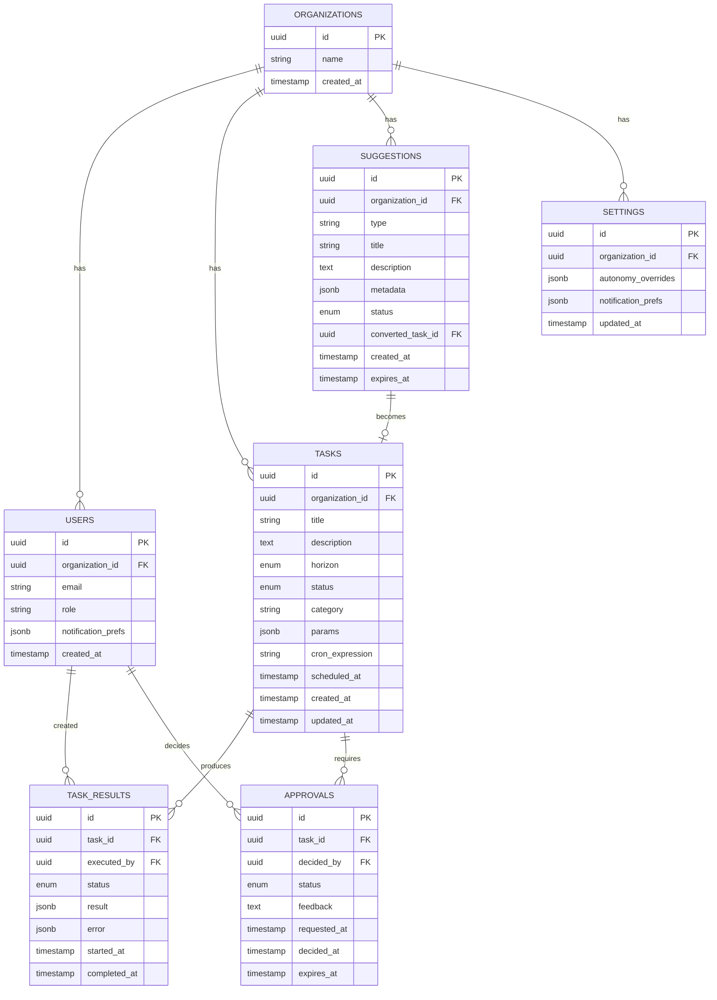

# General Manager MCP App

## Overview

Build a remote MCP server (TypeScript) that serves as an AI-powered "general manager" for small organizations. The system provides:

- **MCP-first architecture**: All functionality exposed via MCP tools
- **OAuth 2.1 authentication** with self-discovery for Claude/OpenAI authorization
- **Interactive dashboard** via MCP Apps extension
- **Task management** across three horizons (short/medium/long-term)
- **Autonomy engine** that decides what needs human approval
- **Proactive suggestions** surfaced via dashboard and email
- **Orchestrator integration** for task execution (separate service)

**Target users**: Solo operators and small teams (2-10 people) who want AI to handle operational tasks.

## Problem Statement / Motivation

Small organization owners are overwhelmed with operational tasks—from responding to inquiries to generating reports to strategic planning. An AI general manager can:

1. Handle routine tasks autonomously
2. Surface what needs attention before it becomes urgent
3. Let owners focus on high-value work by automating the rest
4. Provide a unified interface through Claude/OpenAI chat or a dedicated dashboard

The MCP-first approach ensures the system integrates natively with AI assistants, making it accessible wherever users already work.

## Proposed Solution

A **Rich GM Layer** architecture where GM contains significant organization logic (task classification, autonomy policies, suggestion generation) while connecting to a separate orchestrator service for actual task execution.

```
┌─────────────────────────────────────────────────────────────────────────────────┐
│                              MCP Clients                                         │
│              (Claude, OpenAI, Claude Desktop, VS Code)                          │
└──────────────────────────────────┬──────────────────────────────────────────────┘
                                   │ MCP Protocol (Streamable HTTP)
                                   │ + OAuth 2.1 with Self-Discovery
                                   ▼
┌─────────────────────────────────────────────────────────────────────────────────┐
│                        Cloudflare Edge Network                                   │
│  ┌───────────────────────────────────────────────────────────────────────────┐  │
│  │                    General Manager Worker (Hono)                          │  │
│  │  ┌────────────────┐  ┌────────────────┐  ┌────────────────────────────┐  │  │
│  │  │ MCP Server     │  │ OAuth 2.1      │  │ Organization Logic         │  │  │
│  │  │ (Tools,        │  │ Provider       │  │ - Autonomy Engine          │  │  │
│  │  │  Resources)    │  │ + Discovery    │  │ - Suggestion Generator     │  │  │
│  │  └────────────────┘  └────────────────┘  └────────────────────────────┘  │  │
│  └───────────────────────────────────────────────────────────────────────────┘  │
│                                   │                                              │
│        ┌──────────────────────────┼──────────────────────────┐                  │
│        ▼                          ▼                          ▼                  │
│  ┌────────────────┐  ┌────────────────────────┐  ┌────────────────────────┐    │
│  │ Cloudflare D1  │  │ Cloudflare Queues      │  │ Durable Objects        │    │
│  │ (SQLite)       │  │ (Job Scheduling)       │  │ (Sessions)             │    │
│  │                │  │ + Scheduled Workers    │  │                        │    │
│  └────────────────┘  └────────────────────────┘  └────────────────────────┘    │
│                                                                                  │
│  ┌───────────────────────────────────────────────────────────────────────────┐  │
│  │                    Cloudflare Email Workers                               │  │
│  │               (Notifications: Approvals, Digests, Alerts)                 │  │
│  └───────────────────────────────────────────────────────────────────────────┘  │
└─────────────────────────────────────────────────────────────────────────────────┘
                                   │
                                   │ Streaming HTTP (Real-time progress)
                                   ▼
┌─────────────────────────────────────────────────────────────────────────────────┐
│                         Orchestrator Service                                     │
│              (Executes tasks via external APIs/tools/AI agents)                 │
│                                                                                  │
│  ← Streams: progress updates, completion, errors                                │
└─────────────────────────────────────────────────────────────────────────────────┘


┌─────────────────────────────────────────────────────────────────────────────────┐
│                        MCP App Dashboard (Next.js 16)                           │
│                         Hosted on Cloudflare Pages                              │
│  ┌───────────────────────────────────────────────────────────────────────────┐  │
│  │  Overview  │  Tasks  │  Approvals  │  Suggestions  │  History  │ Settings │  │
│  └───────────────────────────────────────────────────────────────────────────┘  │
│                                   │                                              │
│                    Two-Way MCP App Communication                                │
│                    (postMessage JSON-RPC via sandboxed iframe)                  │
│                                   │                                              │
│           ┌───────────────────────┼───────────────────────┐                     │
│           ▼                       │                       ▼                     │
│  ┌────────────────┐               │              ┌────────────────┐             │
│  │ Dashboard →    │               │              │ Server →       │             │
│  │ Server         │               │              │ Dashboard      │             │
│  │                │               │              │                │             │
│  │ • Call tools   │               │              │ • Notifications│             │
│  │ • Create tasks │               │              │ • Task updates │             │
│  │ • Approve      │               │              │ • Progress     │             │
│  │ • Update       │               │              │ • Suggestions  │             │
│  │   settings     │               │              │                │             │
│  └────────────────┘               │              └────────────────┘             │
│                                   │                                              │
│                    ▲──────────────┴──────────────▲                              │
│                    │    ui:// Resources          │                              │
│                    │    (Embedded in MCP hosts)  │                              │
└─────────────────────────────────────────────────────────────────────────────────┘
```

**Data Flow Summary:**

```
1. Auth:     MCP Client → OAuth 2.1 → GM Worker → D1 (user/org data)
2. Task:     MCP Client → gm_create_task → D1 → Queue → Orchestrator (streaming)
3. Results:  Orchestrator → Stream → GM Worker → D1 → Dashboard notification
4. Approval: GM Worker → Email Worker → User → Dashboard → gm_approve → Queue
5. Dashboard: ui:// resource → Next.js (Pages) ↔ postMessage ↔ GM Worker
```

## Plugin Awareness Integration

### Overview

Skills, commands, and connectors are defined in a separate plugin repository and ingested by the orchestrator service. GM does not edit or execute plugins directly, but needs awareness of them for the task editor interface.

**Key Principles:**
- Orchestrator is the single source of truth for available plugins
- GM queries orchestrator for fresh plugin metadata (no caching)
- Task descriptions are natural language, but users can inject plugin references
- Clicking a skill/command/connector in the UI injects it into the task prompt

### Plugin Entity Types

| Entity | Definition | Injection Format | Example |
|--------|------------|------------------|---------|
| **Skills** | Background automation/knowledge with trigger keywords | `/skill-name` | `/saas-metrics` |
| **Commands** | User-invoked actions with parameters | `/command-name` | `/analyze-ads --campaign "Summer Sale"` |
| **Connectors** | External service integrations (OAuth/API) | `connector:name` | `connector:google-ads` |

### Plugin Metadata Schema

The orchestrator exposes plugin metadata via a dedicated endpoint:

```typescript
// GET /api/plugins
interface PluginRegistry {
  plugins: Plugin[];
  lastUpdated: string;
}

interface Plugin {
  id: string;                    // e.g., "general-manager-online-business"
  name: string;
  version: string;
  description: string;
  skills: Skill[];
  commands: Command[];
  connectors: Connector[];
}

interface Skill {
  id: string;                    // e.g., "saas-metrics"
  name: string;
  description: string;
  triggers: string[];            // Keywords that activate this skill
  category?: string;
}

interface Command {
  id: string;                    // e.g., "analyze-ads"
  name: string;
  description: string;
  parameters: CommandParameter[];
  requiredConnectors: string[];  // Connectors needed for this command
}

interface CommandParameter {
  name: string;                  // e.g., "--from"
  description: string;
  type: 'string' | 'number' | 'boolean' | 'date';
  required: boolean;
  default?: unknown;
}

interface Connector {
  id: string;                    // e.g., "google-ads"
  name: string;
  description: string;
  authType: 'oauth2' | 'api_key' | 'basic';
  status: 'connected' | 'disconnected' | 'error';
  configuredAt?: string;
}
```

### Task Editor UI Integration

```
┌─────────────────────────────────────────────────────────────────────────┐
│ Create Task                                                              │
├─────────────────────────────────────────────────────────────────────────┤
│                                                                          │
│  Title: [Monthly SaaS metrics review                              ]     │
│                                                                          │
│  Description:                                                            │
│  ┌───────────────────────────────────────────────────────────────────┐  │
│  │ Analyze our MRR growth, churn rate, and LTV:CAC ratio for the    │  │
│  │ past month. Use /saas-metrics for calculations. Pull data from   │  │
│  │ connector:stripe for subscription data.                          │  │
│  │                                                                   │  │
│  │ [cursor here]                                                     │  │
│  └───────────────────────────────────────────────────────────────────┘  │
│                                                                          │
│  ┌─────────────────────────────────────────────────────────────────┐    │
│  │ Available Plugins                                    [Refresh ↻] │    │
│  ├─────────────────────────────────────────────────────────────────┤    │
│  │ Skills           Commands          Connectors                    │    │
│  │ ─────────────    ──────────────    ────────────                  │    │
│  │ ● saas-metrics   ● /analyze-ads    ● stripe ✓                    │    │
│  │ ● pricing-strat  ● /analyze-cont   ● google-ads ✓                │    │
│  │ ● customer-succ  ● /analyze-funn   ● google-analytics ○          │    │
│  │                  ● /track-growth   ● postgres ✓                  │    │
│  │                                                                   │    │
│  │ Click to inject into description                                 │    │
│  └─────────────────────────────────────────────────────────────────┘    │
│                                                                          │
│  Horizon: [Short-term ▼]   Schedule: [Run now ▼]                        │
│                                                                          │
│  [Cancel]                                        [Create Task]          │
└─────────────────────────────────────────────────────────────────────────┘

Legend: ✓ = connected, ○ = not connected
```

### Orchestrator API Contract

GM calls the orchestrator to fetch plugin metadata:

```typescript
// apps/worker/services/orchestrator.ts

export async function fetchPluginRegistry(env: Env): Promise<PluginRegistry> {
  const response = await fetch(`${env.ORCHESTRATOR_URL}/api/plugins`, {
    headers: {
      'Authorization': `Bearer ${env.ORCHESTRATOR_API_KEY}`,
      'X-Organization-Id': env.currentOrgId
    }
  });

  if (!response.ok) {
    throw new Error(`Failed to fetch plugins: ${response.status}`);
  }

  return response.json();
}

// Connector status is org-specific (which connectors has THIS org configured)
export async function fetchConnectorStatus(
  env: Env,
  orgId: string
): Promise<ConnectorStatus[]> {
  const response = await fetch(
    `${env.ORCHESTRATOR_URL}/api/connectors/status?orgId=${orgId}`,
    {
      headers: { 'Authorization': `Bearer ${env.ORCHESTRATOR_API_KEY}` }
    }
  );

  return response.json();
}
```

### MCP Tool for Plugin Discovery

```typescript
// gm_list_plugin_elements
{
  name: 'gm_list_plugin_elements',
  description: 'List available skills, commands, and connectors from plugins',
  inputSchema: {
    type: z.enum(['skills', 'commands', 'connectors', 'all']).default('all'),
    search: z.string().optional()  // Filter by name/description
  },
  outputSchema: {
    skills: z.array(SkillSchema),
    commands: z.array(CommandSchema),
    connectors: z.array(ConnectorSchema)
  }
}

// gm_get_command_params
{
  name: 'gm_get_command_params',
  description: 'Get parameter schema for a specific command',
  inputSchema: {
    commandId: z.string()
  },
  outputSchema: {
    command: CommandSchema,
    parameters: z.array(CommandParameterSchema),
    requiredConnectors: z.array(ConnectorSchema)
  }
}
```

### Task Model Update

Tasks store plugin references extracted from the description:

```typescript
// Updated CreateTaskInput
export const CreateTaskInput = z.object({
  title: z.string().min(1).max(200),
  description: z.string(),  // Natural language, may contain /skill, /command, connector:name
  horizon: TaskHorizon,
  category: z.string().optional(),

  // Extracted from description (computed, not user-provided)
  referencedSkills: z.array(z.string()).optional(),     // ['saas-metrics']
  referencedCommands: z.array(z.string()).optional(),   // ['analyze-ads']
  referencedConnectors: z.array(z.string()).optional(), // ['stripe']

  // Command-specific params if a command is referenced
  commandParams: z.record(z.unknown()).optional(),

  scheduledAt: z.string().datetime().optional(),
  cronExpression: z.string().optional()
});
```

### Reference Extraction Logic

```typescript
// packages/shared/utils/plugin-refs.ts

export function extractPluginReferences(description: string): {
  skills: string[];
  commands: string[];
  connectors: string[];
} {
  // Extract /skill-name patterns (skills don't have params)
  const skillPattern = /\/([a-z][a-z0-9-]*)/g;
  const commandPattern = /\/([a-z][a-z0-9-]*)\s*(--[^\n]*)?/g;
  const connectorPattern = /connector:([a-z][a-z0-9-]*)/g;

  const skills: string[] = [];
  const commands: string[] = [];
  const connectors: string[] = [];

  // ... extraction logic
  // Distinguish skills from commands based on plugin registry

  return { skills, commands, connectors };
}
```

### Dashboard Integration

The task editor component fetches plugins on mount:

```typescript
// apps/dashboard/components/TaskEditor.tsx
'use client';

import { useState, useEffect } from 'react';
import { useMcpClient } from '@/lib/mcp-client';

export function TaskEditor() {
  const mcp = useMcpClient();
  const [plugins, setPlugins] = useState<PluginRegistry | null>(null);
  const [description, setDescription] = useState('');

  useEffect(() => {
    // Always fetch fresh on mount
    mcp.callTool('gm_list_plugin_elements', { type: 'all' })
      .then(setPlugins);
  }, []);

  const injectReference = (type: 'skill' | 'command' | 'connector', id: string) => {
    const injection = type === 'connector'
      ? `connector:${id}`
      : `/${id}`;

    setDescription(prev => prev + (prev ? ' ' : '') + injection);
  };

  return (
    <div>
      <textarea
        value={description}
        onChange={(e) => setDescription(e.target.value)}
      />

      <PluginBrowser
        plugins={plugins}
        onSelect={injectReference}
      />
    </div>
  );
}
```

## Technical Approach

### Research Insights: Architecture & Patterns

**From Architecture Analysis:**
- SOLID principles well-aligned; primary concern is Single Responsibility in Worker entry point
- Recommend extracting autonomy engine to separate module early to reduce coupling
- Data flow coherence is strong; streaming HTTP choice well-suited for real-time updates
- Extensibility points identified: task handlers, autonomy rules, notification channels

**From Pattern Recognition:**
- State machine has gaps: need explicit `paused` state for user-requested holds
- Naming inconsistency: `gm_approve` should be `gm_approve_task` for consistency
- Missing transitions: `executing → paused → executing` for resumable tasks
- Task params need discriminated unions per category (see TypeScript section)

**From Simplicity Review (Critical):**
- Recommend consolidating 8 phases → 3 phases for faster iteration:
  1. **Foundation + Core** (Phases 1-3): Auth, Tasks, Scheduling
  2. **Integration + UI** (Phases 4-5): Dashboard, Orchestrator
  3. **Intelligence** (Phases 6-8): Autonomy, Suggestions, Notifications
- Potential ~40-50% LOC reduction by deferring: custom cron parsing (use library), elaborate email templates (start with plain text), granular autonomy rules (start with 3-tier system)

### Technology Stack

| Component | Technology | Rationale |
|-----------|------------|-----------|
| Language | TypeScript | Best MCP SDK support, type safety |
| Runtime | Node.js 24.x | Latest LTS, native fetch, Web Crypto |
| Platform | Cloudflare Workers | Edge deployment, global distribution |
| Framework | Hono | Lightweight, CF-native, Streamable HTTP support |
| Database | Cloudflare D1 | SQLite-based, CF-native, zero config |
| Job Queue | Cloudflare Queues | Durable, CF-native scheduling |
| Email | Cloudflare Email Workers | Native email sending, templates |
| MCP SDK | @modelcontextprotocol/sdk | Official SDK |
| MCP Apps | @modelcontextprotocol/ext-apps | Dashboard UI (two-way interaction) |
| Dashboard | Next.js 16 | SSR, API routes, excellent DX |
| Validation | Zod | Runtime type validation |
| Orchestrator | Streaming HTTP | Real-time task execution updates |
| Deployment | OpenNext | Next.js on Cloudflare Pages |

### Research Insights: TypeScript Patterns

**Branded Types for IDs (Recommended):**
```typescript
// Prevent ID mixups at compile time
type TaskId = string & { readonly __brand: 'TaskId' };
type OrganizationId = string & { readonly __brand: 'OrganizationId' };
type UserId = string & { readonly __brand: 'UserId' };

const createTaskId = (id: string): TaskId => id as TaskId;
```

**Discriminated Unions for Task Params:**
```typescript
// Type-safe task parameters per category
type TaskParams =
  | { category: 'email'; to: string; subject: string; body: string }
  | { category: 'report'; reportType: string; dateRange: DateRange }
  | { category: 'api-call'; endpoint: string; method: string; payload?: unknown };
```

**Typed D1 Queries:**
```typescript
// Use Drizzle ORM or typed query builders for D1
import { drizzle } from 'drizzle-orm/d1';
import { tasks } from './schema';

const db = drizzle(env.DB);
const orgTasks = await db.select()
  .from(tasks)
  .where(eq(tasks.organizationId, orgId));
```

**Hono Best Practices:**
```typescript
// Use Hono's typed context with environment
type Env = { Bindings: CloudflareBindings; Variables: { user: User } };
const app = new Hono<Env>();

// Middleware for org-scoping
app.use('/*', async (c, next) => {
  const user = c.get('user');
  c.set('orgId', user.organizationId);
  await next();
});
```

### Architecture

#### Directory Structure

```
general-manager/
├── apps/
│   ├── worker/                   # Cloudflare Worker (MCP Server)
│   │   ├── src/
│   │   │   ├── index.ts          # Worker entry point
│   │   │   ├── mcp.ts            # MCP server setup
│   │   │   ├── transport.ts      # Streamable HTTP transport
│   │   │   └── session.ts        # Session management (Durable Objects)
│   │   ├── auth/
│   │   │   ├── oauth.ts          # OAuth 2.1 provider
│   │   │   ├── discovery.ts      # Self-discovery endpoints
│   │   │   └── middleware.ts     # Auth middleware
│   │   ├── tools/
│   │   │   ├── tasks.ts          # Task CRUD tools
│   │   │   ├── approvals.ts      # Approval workflow tools
│   │   │   ├── suggestions.ts    # Suggestion tools
│   │   │   └── settings.ts       # Configuration tools
│   │   ├── resources/
│   │   │   └── dashboard.ts      # MCP App UI resources
│   │   ├── services/
│   │   │   ├── autonomy.ts       # Autonomy decision engine
│   │   │   ├── suggestions.ts    # Proactive suggestion generator
│   │   │   ├── scheduler.ts      # Cloudflare Queues scheduling
│   │   │   ├── orchestrator.ts   # Orchestrator client (Streaming HTTP)
│   │   │   └── email.ts          # Cloudflare Email Workers
│   │   ├── db/
│   │   │   ├── client.ts         # D1 client
│   │   │   ├── migrations/       # D1 migrations
│   │   │   └── queries/          # SQL queries
│   │   └── wrangler.toml         # Cloudflare config
│   └── dashboard/                # Next.js 16 Dashboard
│       ├── app/
│       │   ├── layout.tsx
│       │   ├── page.tsx          # Overview
│       │   ├── tasks/
│       │   ├── approvals/
│       │   ├── suggestions/
│       │   ├── history/
│       │   └── settings/
│       ├── components/
│       ├── lib/
│       │   └── mcp-client.ts     # Two-way MCP App communication
│       └── next.config.js
├── packages/
│   └── shared/
│       ├── types/
│       │   ├── schemas.ts        # Zod schemas
│       │   └── index.ts          # Type exports
│       └── package.json
├── docs/
│   ├── plans/
│   └── brainstorms/
├── turbo.json                    # Turborepo config
└── package.json
```

### Research Insights: Security

**Critical Issues Identified:**

1. **Token Storage (Critical):** OAuth tokens must be encrypted at rest in D1
   - Use Cloudflare Workers KV or encrypted columns
   - Never log tokens; use token fingerprints for debugging
   ```typescript
   // Encrypt tokens before storage
   const encryptedToken = await crypto.subtle.encrypt(
     { name: 'AES-GCM', iv },
     key,
     new TextEncoder().encode(token)
   );
   ```

2. **IDOR Prevention (Critical):** All queries must be organization-scoped
   ```typescript
   // WRONG: Direct ID lookup
   const task = await db.query.tasks.findFirst({ where: eq(tasks.id, taskId) });

   // RIGHT: Organization-scoped lookup
   const task = await db.query.tasks.findFirst({
     where: and(eq(tasks.id, taskId), eq(tasks.organizationId, orgId))
   });
   ```

3. **Orchestrator Authentication (Critical):** Use mTLS or signed requests
   - Implement request signing with HMAC
   - Validate orchestrator responses with shared secret

**High Priority Issues:**
- Rate limiting per organization (use Cloudflare Rate Limiting)
- Input validation on all MCP tool inputs (Zod parsing)
- Audit logging for sensitive operations (approvals, settings changes)
- Session timeout and refresh token rotation
- CSRF protection for dashboard actions

### Research Insights: Performance

**D1 Optimization Patterns:**
```sql
-- Composite indexes for common queries
CREATE INDEX idx_tasks_org_status ON tasks(organization_id, status);
CREATE INDEX idx_tasks_org_horizon ON tasks(organization_id, horizon);
CREATE INDEX idx_approvals_org_pending ON approvals(organization_id, status)
  WHERE status = 'pending';

-- Pagination with cursor (not offset)
SELECT * FROM tasks
WHERE organization_id = ? AND id > ?
ORDER BY id LIMIT 50;
```

**Durable Object Sharding:**
- Shard sessions by organization ID to avoid hot spots
- Use stub.id from organization ID hash for consistent routing
```typescript
const sessionId = env.SESSIONS.idFromName(`org:${organizationId}`);
const session = env.SESSIONS.get(sessionId);
```

**Queue Throughput:**
- Batch messages where possible (up to 100 per batch)
- Use visibility timeout for retry handling
- Dead-letter queue for failed messages after 3 retries

**Streaming Connection Handling:**
- Implement connection keep-alive with heartbeats
- Set appropriate timeouts (30s for orchestrator streams)
- Handle backpressure with buffering limits

### Research Insights: Next.js 16 on Cloudflare

**OpenNext Configuration:**
```typescript
// next.config.js
module.exports = {
  output: 'standalone',
  experimental: {
    serverActions: true,
  },
};

// opennext.config.ts
export default {
  default: {
    override: {
      wrapper: 'cloudflare-node',
      converter: 'edge',
    },
  },
};
```

**Server-Sent Events for Real-Time:**
```typescript
// app/api/tasks/[id]/progress/route.ts
export async function GET(request: Request) {
  const encoder = new TextEncoder();
  const stream = new ReadableStream({
    async start(controller) {
      // Subscribe to task progress updates
      const unsubscribe = subscribeToProgress(taskId, (progress) => {
        controller.enqueue(encoder.encode(`data: ${JSON.stringify(progress)}\n\n`));
      });

      request.signal.addEventListener('abort', () => {
        unsubscribe();
        controller.close();
      });
    },
  });

  return new Response(stream, {
    headers: { 'Content-Type': 'text/event-stream' },
  });
}
```

**Server Components for Dashboard:**
- Use RSC for initial data fetching (tasks list, settings)
- Client components only for interactive elements (forms, real-time updates)
- Leverage streaming SSR for faster perceived load times

### Implementation Phases

#### Phase 1: Foundation

**Goal**: Minimal MCP server with OAuth 2.1 that can be connected from Claude/OpenAI.

**Deliverables**:
- Cloudflare Worker with Hono + Streamable HTTP transport
- OAuth 2.1 with PKCE and self-discovery endpoints
- Basic MCP tool: `gm_ping` (health check)
- D1 database setup with organization-scoped queries
- Durable Objects for session management
- Wrangler deployment configuration

**Files**:
```
apps/worker/src/index.ts          # Worker entry point with Hono
apps/worker/src/mcp.ts            # McpServer instantiation
apps/worker/src/transport.ts      # StreamableHTTPServerTransport
apps/worker/auth/oauth.ts         # ProxyOAuthServerProvider
apps/worker/auth/discovery.ts     # /.well-known endpoints
apps/worker/auth/middleware.ts    # bearerAuth middleware
apps/worker/db/client.ts          # D1 client wrapper
apps/worker/db/migrations/0001_init.sql
apps/worker/wrangler.toml         # Cloudflare config
```

**Success Criteria**:
- [ ] Worker deploys to Cloudflare
- [ ] Server accepts MCP connections via Streamable HTTP
- [ ] OAuth flow completes successfully
- [ ] Token refresh works
- [ ] Organization-scoped queries isolate tenant data

#### Phase 2: Task Management Core

**Goal**: Full task CRUD with three horizons, stored in PostgreSQL.

**Deliverables**:
- Task data model with states and horizons
- MCP tools: `gm_list_tasks`, `gm_create_task`, `gm_update_task`, `gm_delete_task`
- Basic filtering/sorting
- Task state machine

**Files**:
```
src/db/migrations/002_tasks.sql
src/tools/tasks.ts
src/types/schemas.ts         # Task Zod schemas
```

**Task State Machine** (enhanced with paused state):
```
draft ──▶ pending ──▶ approved ──▶ queued ──▶ executing ──▶ completed
              │           │           │           │
              ▼           ▼           ▼           ├──▶ paused ──▶ executing
          rejected    cancelled   cancelled       │
                                                  ▼
                                               failed

Valid transitions:
- draft → pending (submit for approval/scheduling)
- pending → approved (autonomy allows or user approves)
- pending → rejected (user rejects)
- approved → queued (scheduled for execution)
- approved → cancelled (user cancels before queue)
- queued → executing (scheduler picks up)
- queued → cancelled (user cancels from queue)
- executing → completed (success)
- executing → failed (error)
- executing → paused (user requests pause)
- paused → executing (user resumes)
- paused → cancelled (user cancels while paused)
```

**Task Horizons**:
| Horizon | Definition | Examples |
|---------|------------|----------|
| short-term | Due within 24h or triggered by event | Respond to inquiry, process order |
| medium-term | Due within 30 days or recurring | Monthly report, weekly inventory |
| long-term | Strategic goals, no specific due date | Market analysis, expansion planning |

**Success Criteria**:
- [ ] Tasks CRUD works via MCP tools
- [ ] Tasks persist across sessions
- [ ] Filtering by horizon/status works
- [ ] State transitions enforce valid paths

#### Phase 3: Job Scheduling

**Goal**: Schedule tasks to run at specific times using Cloudflare Queues.

**Deliverables**:
- Cloudflare Queue setup for task execution
- Scheduled Workers for cron-based jobs
- Job status tracking in D1
- Manual trigger capability (`gm_run_task`)

**Files**:
```
apps/worker/services/scheduler.ts    # Cloudflare Queues setup
apps/worker/consumers/task.ts        # Queue consumer
apps/worker/wrangler.toml            # Queue bindings
```

**Scheduling Patterns**:
```typescript
// One-time scheduled task via Queue
await env.TASK_QUEUE.send({
  taskId,
  scheduledAt: task.scheduledAt
}, {
  delaySeconds: Math.floor((task.scheduledAt - Date.now()) / 1000)
});

// Recurring task via Scheduled Worker (cron triggers)
// wrangler.toml:
// [triggers]
// crons = ["0 * * * *"]  # Hourly check for due recurring tasks

export default {
  async scheduled(event: ScheduledEvent, env: Env) {
    const dueTasks = await getDueRecurringTasks(env.DB);
    for (const task of dueTasks) {
      await env.TASK_QUEUE.send({ taskId: task.id });
    }
  }
};
```

**Success Criteria**:
- [ ] Tasks execute at scheduled times
- [ ] Recurring tasks follow cron patterns via Scheduled Workers
- [ ] Manual trigger via `gm_run_task` works
- [ ] Failed jobs retry with exponential backoff

#### Phase 4: MCP App Dashboard

**Goal**: Interactive dashboard exposed via MCP Apps extension with two-way communication.

**Deliverables**:
- Next.js 16 dashboard with App Router
- Overview, Tasks, Approvals, Suggestions, History, Settings views
- Two-way MCP App communication (dashboard can call tools, receive notifications)
- Server-side rendering for initial load, client-side for interactions
- Bundled and deployed to Cloudflare Pages

**Files**:
```
apps/dashboard/app/layout.tsx
apps/dashboard/app/page.tsx              # Overview
apps/dashboard/app/tasks/page.tsx
apps/dashboard/app/tasks/new/page.tsx    # Task editor with plugin browser
apps/dashboard/app/approvals/page.tsx
apps/dashboard/app/suggestions/page.tsx
apps/dashboard/app/history/page.tsx
apps/dashboard/app/settings/page.tsx
apps/dashboard/lib/mcp-client.ts         # Two-way MCP App RPC
apps/dashboard/components/TaskList.tsx
apps/dashboard/components/TaskEditor.tsx  # Task creation with plugin injection
apps/dashboard/components/PluginBrowser.tsx  # Skills/Commands/Connectors panel
apps/dashboard/components/ApprovalCard.tsx
apps/worker/resources/dashboard.ts       # ui:// resources pointing to Pages
```

**Two-Way MCP App Communication**:
```typescript
// apps/dashboard/lib/mcp-client.ts
import { App } from '@modelcontextprotocol/ext-apps';

const app = new App();

// Dashboard calls MCP tools
export async function createTask(task: CreateTaskInput) {
  return app.callTool('gm_create_task', task);
}

// Dashboard receives server notifications
app.onNotification('task-updated', (data) => {
  // Update UI in real-time
  taskStore.update(data.taskId, data.changes);
});

// Dashboard can request elicitation
export async function requestApproval(taskId: string) {
  return app.requestElicitation({
    mode: 'form',
    message: 'Approve this task?',
    requestedSchema: { decision: { type: 'string', enum: ['approve', 'reject'] } }
  });
}
```

**Dashboard Views**:
| View | URI | Purpose |
|------|-----|---------|
| Overview | `ui://dashboard/overview` | Status widgets, pending items |
| Tasks | `ui://dashboard/tasks` | Task list with CRUD |
| Approvals | `ui://dashboard/approvals` | Pending approval queue |
| Suggestions | `ui://dashboard/suggestions` | Proactive suggestions |
| History | `ui://dashboard/history` | Execution history |
| Settings | `ui://dashboard/settings` | Autonomy & notifications |

**Success Criteria**:
- [ ] Dashboard renders in Claude/VS Code/supported hosts
- [ ] Can view and manage tasks via two-way communication
- [ ] Real-time updates work (server → dashboard)
- [ ] Dashboard can call tools (dashboard → server)
- [ ] Settings persist

#### Phase 5: Orchestrator Integration

**Goal**: Connect to orchestrator service via Streaming HTTP for real-time task execution updates.

**Deliverables**:
- Orchestrator client with Streaming HTTP (not REST)
- Real-time progress updates streamed back to GM
- Mock orchestrator for development
- Result handling and storage in D1
- `gm_get_task_result`, `gm_list_results` tools

**Files**:
```
apps/worker/services/orchestrator.ts # Streaming HTTP orchestrator client
apps/worker/db/migrations/0003_results.sql
apps/worker/tools/results.ts
```

**Streaming HTTP Orchestrator Protocol**:
```typescript
// apps/worker/services/orchestrator.ts

export async function executeTask(task: Task, env: Env): Promise<void> {
  const response = await fetch(`${env.ORCHESTRATOR_URL}/execute`, {
    method: 'POST',
    headers: { 'Content-Type': 'application/json' },
    body: JSON.stringify({
      taskId: task.id,
      type: task.category,
      params: task.params
    })
  });

  // Stream response for real-time updates
  const reader = response.body?.getReader();
  const decoder = new TextDecoder();

  while (reader) {
    const { done, value } = await reader.read();
    if (done) break;

    const chunk = decoder.decode(value);
    const events = chunk.split('\n\n').filter(Boolean);

    for (const event of events) {
      const data = JSON.parse(event.replace('data: ', ''));

      switch (data.type) {
        case 'progress':
          // Update task progress in D1, notify dashboard
          await updateTaskProgress(env.DB, task.id, data.progress);
          break;
        case 'completed':
          await storeTaskResult(env.DB, task.id, data.result);
          break;
        case 'failed':
          await handleTaskFailure(env.DB, task.id, data.error);
          break;
      }
    }
  }
}
```

**Streaming Events from Orchestrator**:
```
data: {"type":"progress","progress":25,"message":"Fetching data..."}

data: {"type":"progress","progress":50,"message":"Processing..."}

data: {"type":"progress","progress":100,"message":"Complete"}

data: {"type":"completed","result":{"summary":"Monthly report generated","fileUrl":"..."}}
```

**Success Criteria**:
- [ ] Tasks sent to orchestrator via Streaming HTTP
- [ ] Progress updates received in real-time
- [ ] Results stored in D1 and queryable
- [ ] Failures trigger retry/notification
- [ ] Dashboard shows live progress

#### Phase 6: Autonomy Engine

**Goal**: Decide which actions need human approval.

**Deliverables**:
- Autonomy decision engine
- Configurable autonomy levels per category
- Approval workflow tools: `gm_list_pending`, `gm_approve`, `gm_reject`
- Approval queue in dashboard

**Files**:
```
src/services/autonomy.ts
src/db/migrations/004_approvals.sql
src/tools/approvals.ts
ui/src/views/Approvals.ts
```

**Autonomy Levels**:
| Level | Behavior |
|-------|----------|
| high | Auto-execute, log result |
| medium | Notify user, execute after 1h if no objection |
| low | Require explicit approval before execution |

**Autonomy Rules** (defaults):
| Action Type | Risk Factor | Default Level |
|-------------|-------------|---------------|
| Read data | None | high |
| Internal data update | Low | high |
| External API call (read) | Low | high |
| External API call (write) | Medium | medium |
| Send email/message | High | low |
| Financial transaction | High | low |
| Delete data | High | low |

**User Configuration**:
Users can override defaults per task category:
```json
{
  "autonomyOverrides": {
    "invoice-reminders": "high",
    "payments": "low"
  }
}
```

**Success Criteria**:
- [ ] Autonomy engine evaluates all tasks
- [ ] Actions respect configured levels
- [ ] Approval queue shows pending items
- [ ] Approve/reject flows work

#### Phase 7: Proactive Suggestions

**Goal**: System identifies what needs doing and surfaces proactively.

**Deliverables**:
- Suggestion generator service
- Suggestion data model
- `gm_list_suggestions`, `gm_accept_suggestion`, `gm_dismiss_suggestion` tools
- Suggestions view in dashboard

**Files**:
```
src/services/suggestions.ts
src/db/migrations/005_suggestions.sql
src/tools/suggestions.ts
ui/src/views/Suggestions.ts
```

**Suggestion Types**:
| Type | Trigger | Example |
|------|---------|---------|
| reactive | Event occurred | "Customer inquiry received" |
| scheduled | Time-based check | "Monthly report due in 3 days" |
| analytical | Pattern detected | "Sales down 15% vs last month" |

**Suggestion Lifecycle**:
```
generated ──▶ pending ──▶ accepted ──▶ (becomes task)
                │
                ├──▶ dismissed
                │
                └──▶ expired (after 7 days)
```

**Success Criteria**:
- [ ] Suggestions generated automatically
- [ ] Users can accept (creates task) or dismiss
- [ ] Dashboard shows prioritized suggestions
- [ ] Dismissed suggestions inform future generation

#### Phase 8: Email Notifications

**Goal**: Time-sensitive notifications via email.

**Deliverables**:
- Email service integration (Resend)
- Notification templates
- Notification preferences
- Digest scheduling (immediate/daily/weekly)

**Files**:
```
apps/worker/services/email.ts              # Cloudflare Email Workers
apps/worker/templates/approval-request.ts  # Email templates (TSX or MJML)
apps/worker/templates/suggestion-digest.ts
apps/worker/templates/task-completed.ts
apps/worker/db/migrations/0006_notification_prefs.sql
```

**Email Types**:
| Type | Trigger | Urgency |
|------|---------|---------|
| Approval request | New pending approval | Immediate |
| Task failed | Execution failure | Immediate |
| Suggestion digest | New suggestions | Daily/Weekly |
| Weekly summary | End of week | Weekly |

**Success Criteria**:
- [ ] Emails send on triggers
- [ ] Templates render correctly
- [ ] Preferences respected
- [ ] Unsubscribe works

---

## Data Models

### ERD



### Key Schemas (Zod)

```typescript
// src/types/schemas.ts

import { z } from 'zod';

export const TaskHorizon = z.enum(['short-term', 'medium-term', 'long-term']);

export const TaskStatus = z.enum([
  'draft',
  'pending',
  'approved',
  'queued',
  'executing',
  'paused',      // Added: user-requested hold
  'completed',
  'failed',
  'rejected',
  'cancelled'
]);

export const AutonomyLevel = z.enum(['high', 'medium', 'low']);

export const CreateTaskInput = z.object({
  title: z.string().min(1).max(200),
  description: z.string().optional(),
  horizon: TaskHorizon,
  category: z.string().optional(),
  params: z.record(z.unknown()).optional(),
  scheduledAt: z.string().datetime().optional(),
  cronExpression: z.string().optional()
});

export const ApprovalDecision = z.object({
  taskId: z.string().uuid(),
  decision: z.enum(['approve', 'reject']),
  feedback: z.string().optional()
});

export const SettingsUpdate = z.object({
  autonomyOverrides: z.record(AutonomyLevel).optional(),
  notificationPrefs: z.object({
    emailDigest: z.enum(['immediate', 'daily', 'weekly', 'none']),
    approvalAlerts: z.boolean(),
    failureAlerts: z.boolean()
  }).optional()
});
```

---

## MCP Tools Specification

### Research Insights: Agent-Native Compliance

**Current Compliance Score: 78%** - Good foundation, needs additions for full agent parity.

**Missing Tools Identified:**

1. **`gm_get_overview`** - Agents need a single tool to get full context
   ```typescript
   {
     name: 'gm_get_overview',
     description: 'Get complete dashboard overview in one call',
     outputSchema: {
       pendingApprovals: z.number(),
       activeTasks: z.number(),
       suggestions: z.array(SuggestionSchema),
       recentResults: z.array(TaskResultSchema),
       systemHealth: z.object({ queueDepth: z.number(), lastError: z.string().nullable() })
     }
   }
   ```

2. **`gm_cancel_task`** - Agents need ability to stop running tasks
   ```typescript
   {
     name: 'gm_cancel_task',
     description: 'Cancel a running or queued task',
     inputSchema: { taskId: z.string().uuid(), reason: z.string().optional() },
     outputSchema: { success: z.boolean(), finalStatus: TaskStatus }
   }
   ```

3. **`gm_get_task_progress`** - Real-time progress for executing tasks
   ```typescript
   {
     name: 'gm_get_task_progress',
     description: 'Get current progress of an executing task',
     inputSchema: { taskId: z.string().uuid() },
     outputSchema: {
       status: TaskStatus,
       progress: z.number().min(0).max(100),
       currentStep: z.string().optional(),
       estimatedCompletion: z.string().datetime().optional()
     }
   }
   ```

**Tool Naming Consistency:**
- Rename `gm_approve` → `gm_approve_task`
- Rename `gm_reject` → `gm_reject_task`
- All tools follow pattern: `gm_<verb>_<noun>`

**Agent-Native Principles Applied:**
- Every dashboard view has equivalent tool(s)
- Bulk operations available (`gm_bulk_approve`, `gm_bulk_dismiss`)
- Filtering/sorting exposed in tool params, not just UI
- Error messages are actionable (include suggested next tool call)

### Task Management

```typescript
// gm_list_tasks
{
  name: 'gm_list_tasks',
  description: 'List tasks with optional filters',
  inputSchema: {
    horizon: z.enum(['short-term', 'medium-term', 'long-term']).optional(),
    status: TaskStatus.optional(),
    category: z.string().optional(),
    limit: z.number().default(50),
    offset: z.number().default(0)
  },
  outputSchema: {
    tasks: z.array(TaskSchema),
    total: z.number()
  }
}

// gm_create_task
{
  name: 'gm_create_task',
  description: 'Create a new task',
  inputSchema: CreateTaskInput,
  outputSchema: { task: TaskSchema }
}

// gm_update_task
{
  name: 'gm_update_task',
  description: 'Update an existing task',
  inputSchema: {
    taskId: z.string().uuid(),
    ...CreateTaskInput.partial().shape
  },
  outputSchema: { task: TaskSchema }
}

// gm_delete_task
{
  name: 'gm_delete_task',
  description: 'Delete a task',
  inputSchema: { taskId: z.string().uuid() },
  outputSchema: { success: z.boolean() }
}

// gm_run_task
{
  name: 'gm_run_task',
  description: 'Manually trigger a task execution',
  inputSchema: { taskId: z.string().uuid() },
  outputSchema: { executionId: z.string().uuid() }
}
```

### Approvals

```typescript
// gm_list_pending
{
  name: 'gm_list_pending',
  description: 'List items awaiting approval',
  inputSchema: {
    limit: z.number().default(20)
  },
  outputSchema: {
    approvals: z.array(ApprovalSchema)
  }
}

// gm_approve_task (renamed from gm_approve for consistency)
{
  name: 'gm_approve_task',
  description: 'Approve a pending action',
  inputSchema: { taskId: z.string().uuid() },
  outputSchema: { success: z.boolean(), task: TaskSchema }
}

// gm_reject_task (renamed from gm_reject for consistency)
{
  name: 'gm_reject_task',
  description: 'Reject a pending action',
  inputSchema: {
    taskId: z.string().uuid(),
    feedback: z.string().optional()
  },
  outputSchema: { success: z.boolean(), task: TaskSchema }
}
```

### Suggestions

```typescript
// gm_list_suggestions
{
  name: 'gm_list_suggestions',
  description: 'List proactive suggestions',
  inputSchema: {
    limit: z.number().default(10)
  },
  outputSchema: {
    suggestions: z.array(SuggestionSchema)
  }
}

// gm_accept_suggestion
{
  name: 'gm_accept_suggestion',
  description: 'Accept a suggestion (converts to task)',
  inputSchema: { suggestionId: z.string().uuid() },
  outputSchema: { task: TaskSchema }
}

// gm_dismiss_suggestion
{
  name: 'gm_dismiss_suggestion',
  description: 'Dismiss a suggestion',
  inputSchema: { suggestionId: z.string().uuid() },
  outputSchema: { success: z.boolean() }
}
```

### Configuration

```typescript
// gm_get_settings
{
  name: 'gm_get_settings',
  description: 'Get current settings',
  inputSchema: {},
  outputSchema: { settings: SettingsSchema }
}

// gm_update_settings
{
  name: 'gm_update_settings',
  description: 'Update settings',
  inputSchema: SettingsUpdate,
  outputSchema: { settings: SettingsSchema }
}
```

### Overview & Progress (Agent-Native Additions)

```typescript
// gm_get_overview
{
  name: 'gm_get_overview',
  description: 'Get complete dashboard overview in one call',
  inputSchema: {},
  outputSchema: {
    pendingApprovals: z.number(),
    activeTasks: z.number(),
    queuedTasks: z.number(),
    suggestions: z.array(SuggestionSchema).max(5),
    recentResults: z.array(TaskResultSchema).max(10),
    systemHealth: z.object({
      queueDepth: z.number(),
      lastError: z.string().nullable(),
      orchestratorStatus: z.enum(['healthy', 'degraded', 'unavailable'])
    })
  }
}

// gm_get_task_progress
{
  name: 'gm_get_task_progress',
  description: 'Get current progress of an executing task',
  inputSchema: { taskId: z.string().uuid() },
  outputSchema: {
    taskId: z.string().uuid(),
    status: TaskStatus,
    progress: z.number().min(0).max(100),
    currentStep: z.string().optional(),
    estimatedCompletion: z.string().datetime().optional(),
    logs: z.array(z.object({
      timestamp: z.string().datetime(),
      message: z.string()
    })).max(20)
  }
}

// gm_cancel_task
{
  name: 'gm_cancel_task',
  description: 'Cancel a running or queued task',
  inputSchema: {
    taskId: z.string().uuid(),
    reason: z.string().optional()
  },
  outputSchema: {
    success: z.boolean(),
    finalStatus: TaskStatus,
    message: z.string()
  }
}
```

### Plugin Discovery

```typescript
// gm_list_plugin_elements
{
  name: 'gm_list_plugin_elements',
  description: 'List available skills, commands, and connectors from registered plugins',
  inputSchema: {
    type: z.enum(['skills', 'commands', 'connectors', 'all']).default('all'),
    search: z.string().optional(),
    pluginId: z.string().optional()  // Filter by specific plugin
  },
  outputSchema: {
    plugins: z.array(z.object({
      id: z.string(),
      name: z.string(),
      version: z.string(),
      description: z.string()
    })),
    skills: z.array(z.object({
      id: z.string(),
      pluginId: z.string(),
      name: z.string(),
      description: z.string(),
      triggers: z.array(z.string())
    })),
    commands: z.array(z.object({
      id: z.string(),
      pluginId: z.string(),
      name: z.string(),
      description: z.string(),
      requiredConnectors: z.array(z.string())
    })),
    connectors: z.array(z.object({
      id: z.string(),
      name: z.string(),
      description: z.string(),
      status: z.enum(['connected', 'disconnected', 'error'])
    }))
  }
}

// gm_get_command_details
{
  name: 'gm_get_command_details',
  description: 'Get full details and parameter schema for a specific command',
  inputSchema: {
    commandId: z.string()
  },
  outputSchema: {
    command: z.object({
      id: z.string(),
      name: z.string(),
      description: z.string(),
      parameters: z.array(z.object({
        name: z.string(),
        description: z.string(),
        type: z.enum(['string', 'number', 'boolean', 'date']),
        required: z.boolean(),
        default: z.unknown().optional()
      })),
      requiredConnectors: z.array(z.object({
        id: z.string(),
        name: z.string(),
        status: z.enum(['connected', 'disconnected', 'error'])
      }))
    })
  }
}

// gm_get_skill_details
{
  name: 'gm_get_skill_details',
  description: 'Get full details for a specific skill including triggers',
  inputSchema: {
    skillId: z.string()
  },
  outputSchema: {
    skill: z.object({
      id: z.string(),
      name: z.string(),
      description: z.string(),
      triggers: z.array(z.string()),
      category: z.string().optional()
    })
  }
}
```

### Bulk Operations

```typescript
// gm_bulk_approve
{
  name: 'gm_bulk_approve',
  description: 'Approve multiple pending tasks at once',
  inputSchema: {
    taskIds: z.array(z.string().uuid()).min(1).max(50)
  },
  outputSchema: {
    approved: z.array(z.string().uuid()),
    failed: z.array(z.object({
      taskId: z.string().uuid(),
      error: z.string()
    }))
  }
}

// gm_bulk_dismiss
{
  name: 'gm_bulk_dismiss',
  description: 'Dismiss multiple suggestions at once',
  inputSchema: {
    suggestionIds: z.array(z.string().uuid()).min(1).max(50)
  },
  outputSchema: {
    dismissed: z.array(z.string().uuid()),
    failed: z.array(z.object({
      suggestionId: z.string().uuid(),
      error: z.string()
    }))
  }
}
```

---

## Alternative Approaches Considered

### 1. Thin MCP Proxy (Rejected)
GM as minimal proxy, orchestrator owns all organization logic.
- **Pro**: Simpler GM, orchestrator reusable
- **Con**: Slower iteration on autonomy/suggestions, tighter coupling
- **Why rejected**: User experience and decision-making need tight integration

### 2. Event-Driven Microservices (Rejected)
Separate services for scheduling, autonomy, suggestions.
- **Pro**: Maximum scalability, independent deployment
- **Con**: Infrastructure overhead, debugging complexity
- **Why rejected**: Overkill for MVP, adds unnecessary complexity

### 3. PostgreSQL (Rejected)
Traditional RDBMS instead of D1.
- **Pro**: Full SQL, native RLS, proven at scale
- **Con**: Requires separate managed service, additional latency from edge
- **Why rejected**: D1 is CF-native, zero-config, lower latency from edge workers; organization-scoped queries provide adequate isolation

---

## Acceptance Criteria

### Functional Requirements

- [ ] Users can authenticate via OAuth 2.1 with Claude/OpenAI
- [ ] Users can create, view, update, and delete tasks
- [ ] Tasks can be scheduled for specific times or recurring patterns
- [ ] Autonomy engine correctly routes tasks to approval or auto-execution
- [ ] Users receive email notifications for time-sensitive items
- [ ] Dashboard displays current status, pending approvals, suggestions
- [ ] Users can configure autonomy levels per task category
- [ ] System proactively generates and surfaces suggestions

### Non-Functional Requirements

- [ ] OAuth flow completes in < 5s
- [ ] Dashboard loads in < 2s
- [ ] Scheduled tasks execute within 60s of scheduled time
- [ ] Email notifications sent within 60s of trigger
- [ ] System handles 100 concurrent MCP connections
- [ ] 99.9% uptime target

### Quality Gates

- [ ] Unit test coverage > 80%
- [ ] Integration tests for all MCP tools
- [ ] E2E test for OAuth + task creation + execution
- [ ] Security review for OAuth implementation
- [ ] Load test for 100 concurrent users

### Security Requirements (from Research)

- [ ] OAuth tokens encrypted at rest (AES-GCM)
- [ ] All database queries organization-scoped
- [ ] No tokens in logs (use fingerprints)
- [ ] Rate limiting per organization enabled
- [ ] Audit log for approvals, settings changes, deletions
- [ ] Orchestrator requests signed (HMAC or mTLS)
- [ ] Session timeout and refresh token rotation

### Agent-Native Requirements (from Research)

- [ ] `gm_get_overview` tool provides full dashboard context
- [ ] `gm_cancel_task` enables stopping running tasks
- [ ] `gm_get_task_progress` exposes real-time progress
- [ ] All tools follow `gm_<verb>_<noun>` naming
- [ ] Error messages include suggested next action
- [ ] Bulk operations available for approvals and dismissals

---

## Success Metrics

| Metric | Target | Measurement |
|--------|--------|-------------|
| OAuth completion rate | > 95% | Successful auth / auth attempts |
| Task execution success | > 99% | Completed / (completed + failed) |
| Approval response time | < 24h median | Time from request to decision |
| Suggestion acceptance rate | > 30% | Accepted / (accepted + dismissed) |
| Email deliverability | > 99% | Delivered / sent |

---

## Dependencies & Prerequisites

### Cloudflare Services
- Cloudflare Workers (compute)
- Cloudflare D1 (database)
- Cloudflare Queues (job scheduling)
- Cloudflare Email Workers (notifications)
- Cloudflare Pages (dashboard hosting)
- Cloudflare Durable Objects (session management)

### External Services
- Orchestrator service (mock for MVP, real service later)
  - Must expose `GET /api/plugins` endpoint for plugin registry
  - Must expose `GET /api/connectors/status` for org-specific connector status
  - Plugin repository ingestion handled by orchestrator

### MCP SDK Requirements
- @modelcontextprotocol/sdk ^2.0.0
- @modelcontextprotocol/ext-apps ^1.0.0

### Development Environment
- Node.js 24.x
- pnpm
- Wrangler CLI (Cloudflare)
- Miniflare (local development)

---

## Open Questions: Plugin Integration

These questions may need resolution during implementation:

1. **Connector configuration UI**: Should GM have a UI to configure connectors (OAuth flows), or is that orchestrator's responsibility?
   - Current assumption: Orchestrator handles connector setup, GM only displays status

2. **Plugin versioning**: What happens when plugin version changes mid-task execution?
   - Current assumption: Tasks execute with plugin version available at execution time

3. **Missing connectors**: How should GM handle tasks that reference connectors the org hasn't configured?
   - Current assumption: Show warning in task editor, allow creation but mark as "needs setup"

4. **Command parameter validation**: Should GM validate command params against schema before sending to orchestrator?
   - Current assumption: Basic type validation in GM, orchestrator does full validation

5. **Skill vs Command distinction**: How does GM distinguish between skills and commands in `/name` syntax?
   - Current assumption: Query plugin registry, skills and commands have non-overlapping IDs

---

## Risk Analysis & Mitigation

| Risk | Likelihood | Impact | Mitigation |
|------|------------|--------|------------|
| MCP Apps extension API changes | Medium | High | Pin SDK versions, abstract UI layer |
| OAuth integration complexity | Medium | Medium | Use official SDK helpers, test with multiple providers |
| Orchestrator unavailability | High | High | Implement retry, dead-letter queue, fallback UI |
| Email deliverability issues | Low | Medium | Use reputable provider, implement bounce handling |
| Multi-tenant data leak | Low | Critical | Mandatory org-scoping, encrypted tokens, audit logging |
| Token theft/exposure | Medium | Critical | AES-GCM encryption, no token logging, rotation policy |
| IDOR vulnerabilities | Medium | High | Organization-scoped queries enforced at ORM level |
| Orchestrator spoofing | Low | High | mTLS or HMAC request signing |
| Rate limit abuse | Medium | Medium | Cloudflare Rate Limiting per organization |
| D1 performance at scale | Medium | Medium | Composite indexes, cursor pagination, query optimization |

---

## Future Considerations

### Post-MVP
- SMS/push notifications
- Webhook integrations for external systems
- Mobile app (React Native)
- Autonomy learning from user decisions
- Team collaboration (task assignment, delegation)
- Audit log viewer in dashboard
- API rate limiting and usage quotas
- Billing integration

### Extensibility Points
- Plugin system for custom task types
- Custom autonomy rules DSL
- Webhook for external trigger sources
- White-label dashboard theming

---

## Documentation Plan

| Document | Location | When |
|----------|----------|------|
| API Reference | docs/api.md | After Phase 2 |
| OAuth Setup Guide | docs/oauth-setup.md | After Phase 1 |
| Dashboard User Guide | docs/dashboard.md | After Phase 4 |
| Deployment Guide | docs/deployment.md | After Phase 1 |
| Architecture Decision Records | docs/adr/ | Ongoing |

---

## References & Research

### Internal References
- Brainstorm: docs/brainstorms/2026-02-03-general-manager-mcp-app-brainstorm.md
- Best Practices Research: docs/BEST_PRACTICES_RESEARCH.md

### External References
- [MCP Specification 2025-11-25](https://modelcontextprotocol.io/specification/2025-11-25)
- [MCP TypeScript SDK](https://github.com/modelcontextprotocol/typescript-sdk)
- [MCP Apps Extension Docs](https://modelcontextprotocol.io/docs/extensions/apps)
- [OAuth 2.1 Draft](https://datatracker.ietf.org/doc/html/draft-ietf-oauth-v2-1)
- [BullMQ Documentation](https://bullmq.io)
- [Cloudflare D1](https://developers.cloudflare.com/d1/)
- [Cloudflare Queues](https://developers.cloudflare.com/queues/)
- [Cloudflare Email Workers](https://developers.cloudflare.com/email-routing/email-workers/)

### Standards
- RFC 8414 (OAuth Server Metadata)
- RFC 7591 (Dynamic Client Registration)
- RFC 8707 (Resource Indicators)

---

## Enhancement Summary

This plan was enhanced through parallel research across 8 specialized domains. Key improvements:

### Architecture Improvements
- **Consolidated phases**: 8 → 3 phases for faster iteration
- **Extensibility points**: Task handlers, autonomy rules, notification channels identified
- **State machine**: Added `paused` state and `executing ↔ paused` transitions
- **Naming consistency**: All tools follow `gm_<verb>_<noun>` pattern

### Security Hardening
| Issue | Severity | Mitigation |
|-------|----------|------------|
| Token storage | Critical | AES-GCM encryption at rest |
| IDOR vulnerabilities | Critical | Mandatory org-scoping on all queries |
| Orchestrator auth | Critical | mTLS or HMAC request signing |
| Rate limiting | High | Cloudflare Rate Limiting per org |
| Audit logging | High | Log all sensitive operations |

### Performance Optimizations
- D1 composite indexes for common query patterns
- Cursor-based pagination (not offset)
- Durable Object sharding by organization
- Queue message batching (up to 100)
- SSE for real-time dashboard updates

### Agent-Native Additions
| New Tool | Purpose |
|----------|---------|
| `gm_get_overview` | Single-call dashboard context |
| `gm_cancel_task` | Stop running/queued tasks |
| `gm_get_task_progress` | Real-time execution progress |
| `gm_bulk_approve` | Batch approval operations |
| `gm_bulk_dismiss` | Batch suggestion dismissal |

### TypeScript Best Practices
- Branded types for ID safety (TaskId, OrganizationId, UserId)
- Discriminated unions for type-safe task params
- Drizzle ORM for typed D1 queries
- Hono typed context with environment bindings

### Next.js 16 / Cloudflare Integration
- OpenNext for Cloudflare Pages deployment
- Server Components for initial data fetching
- SSE routes for real-time progress streaming
- Client components only for interactive elements

### Simplification Recommendations
- Defer custom cron parsing (use `cron-parser` library)
- Start with plain text emails (elaborate templates later)
- Begin with 3-tier autonomy (high/medium/low), add granularity later
- Potential 40-50% LOC reduction in MVP scope

### Revised Phase Structure

**Phase 1: Foundation + Core** (combines original Phases 1-3)
- Cloudflare Worker + Hono + MCP server
- OAuth 2.1 with self-discovery
- Task CRUD with horizons and state machine
- Cloudflare Queues scheduling
- D1 database with org-scoped queries

**Phase 2: Integration + UI** (combines original Phases 4-5)
- Next.js 16 dashboard on Cloudflare Pages
- Two-way MCP App communication
- Orchestrator client with streaming HTTP
- Real-time progress updates
- Result storage and querying

**Phase 3: Intelligence** (combines original Phases 6-8)
- Autonomy decision engine (3-tier system)
- Approval workflow
- Proactive suggestion generator
- Email notifications via CF Email Workers
- Notification preferences

This consolidated approach enables:
- Faster time to usable MVP
- Earlier user feedback on core value proposition
- Reduced context switching between phases
- Clearer ownership per phase
